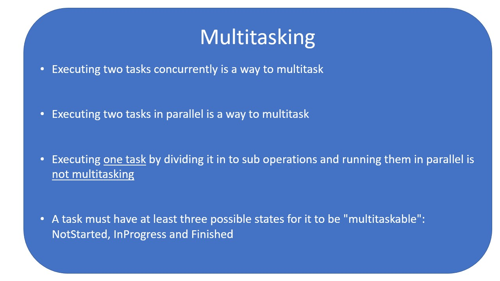

# What's the difference between concurrency and parallelism? 

We’ll right of the bat dive into this subject by defining what concurrency is, and since it’s very easy to confuse concurrent with parallel we have to try to make the difference clear from the get go.

> Concurrency is about **dealing** with a lot of things at the same time.

> Parallelism is about **doing** a lot of things at the same time.

We call the concept of progressing multiple tasks at the same time `Multitasking`.
There are several ways to multitask. One is by **progressing** tasks concurrently,
but not at the same time. Another is to progress two tasks at the exact same time in parallel.

## Lets start off with some definitions

### Resource
Something we need to be able to progress a task. Our resources is limited. This
could be CPU time or memory.

### Task
A set of operations that requires some kind of resource to progress. A task must
consist of several sub-operations.

### Parallel
Something happening independently at the **exact** same time.

### Concurrent
Tasks that are **`in progress`** at the same time, but not *necessarily* progressing
simultaneously. 

This is an important distinction. If two tasks are running concurrently, 
but are not running in parallel, they must be able to stop and resume their progress. 
We say that a task is `interruptable` if it allows for this kind of concurrency.

## The mental model I use.

I firmly believe the main reason we find parallel and concurrent programming 
hard to reason about stems from how we model events in our everyday life. We 
tend to define these terms loosely so our intuition is often wrong. 
> It doesn't help that **concurrent** is defined in the dictionary as: _operating or occurring at the same time_ which 
> doesn't really help us much when trying to describe how it differs from **parallel**

For me, this first clicked when I started to understand why we want to make a distinction between parallel and concurrent in the first place!

The **why** has everything to do with resource utilization and [efficiency](https://en.wikipedia.org/wiki/Efficiency).

> Efficiency is the (often measurable) ability to avoid wasting materials, energy, efforts, money, and time in doing something or in producing a desired result.

### Parallelism

Is increasing the resources we use to solve a task. It has nothing to do with _efficiency_.

### Concurrency

Has everything to do with efficiency and resource utilization. Concurrency can never make _one single task go faster_. 
It can only help us utilize our resources better and thereby _finish a set of tasks faster_.

### Let's draw some parallels to process economics

In businesses that manufacture goods, we often talk about LEAN processes. And 
this is pretty easy to compare with why programmers care so much about what we can 
achieve if we handle tasks concurrently. 

I'll let let this 3 minute video explain it for me:

<iframe width="560" height="315" src="https://www.youtube.com/embed/Oz8BR5Lflzg" frameborder="0" allow="accelerometer; autoplay; encrypted-media; gyroscope; picture-in-picture" allowfullscreen></iframe>

Ok, so it's not the newest video on the subject, but it's explains a lot in 3 minutes. Most importantly the gains we try to achieve when applying LEAN techniques, and most importantly: **eliminate waiting and non-value-adding tasks.**

> In programming we could say that we want to avoid `blocking` and `polling` (in a busy loop).

Now would adding more resources (more workers) help in the video above? Yes, but we use double the resources to produce the same output as one person with an optimal process could do. That's not the best utilization of our resources.

> To continue the parallel we started, we could say that we could solve the problem of a freezing UI while waiting for an I/O event to occur 
> by spawning a new thread and `poll`in a loop or `block` there instead of our main thread. However, that new 
> thread is either consuming resources doing nothing, or worse, using one core to busy loop while checking if 
> an event is ready. Either way it's not optimal, especially if you run a server you want to utilize fully.

If you consider the coffee machine as some I/O resource, we would like to start that process, then move on to preparing the 
next job, or do other work that needs to be done instead of waiting.

_But that means there are things happening in parallel here?_

Yes, the coffee machine is doing work while the "worker" is doing
maintenance and filling water. But this is the crux: _Our reference frame is the worker, not the whole system. The guy making coffee is your code._ 

> It's the same when you make a database query. After you've sent the query to the database server, 
> the CPU on the database server will be working on your request while you wait for a response. In > practice, it's a way
> of parallelizing your work. 

**Concurrency is about working smarter. Parallelism is a way of throwing more resources at the problem.**

## Concurrency and its relation to I/O

As you might understand from what I've written so far, writing async code mostly
makes sense when you need to be smart to make optimal use of your resources.

Now, if you write a program that is working hard to solve a problem, there often is no help
in concurrency, this is where parallelism comes in to play since it gives you
a way to throw more resources at the problem if you can split it into parts that
you can work on in parallel.

**I can see two major use cases for concurrency:**

1. When performing I/O and you need to wait for some external event to occur
2. When you need to divide your attention and prevent one task from waiting too 
long

The first is the classic I/O example, where you will have to wait for a network
call, a file operation or something else to happen before you can progress one 
task, but you have many tasks to do so instead of waiting you continue work 
elsewhere and either check in regularly to see if the task is ready to progress
or make sure you are notified when that task is ready to progress.

The second is an example that is often the case when having an UI. Let's pretend
you only have one core. How do you prevent the whole UI from becoming unresponsive
while performing other CPU intensive tasks?

Well, you can stop what ever task you're doing every 16ms, and run the "update UI"
task, and then resume whatever you were doing afterwards. This way, you will have
to stop/resume your task 60 times a second, but you will also have a fully 
responsive UI which has roughly a 60 Hz refresh rate.

## What about threads provided by the OS?

We'll cover threads a bit more when we talk about operating systems, but I'll 
mention them here as well. The problem with threads provided by the operating 
system is that they appear to be mapped to cores. But that is not necessarily 
the truth even though most operating systems will try to map one thread to a 
core up to the number of threads is equal to  the number of cores.

Once we create more threads than there are cores, the OS will switch between our
threads and progress each of them `concurrently` using the scheduler to give each
thread some time to run. So in this way, threads can be a means to perform tasks
in parallel, but they can also be a means to achieve concurrency.

This brings me over to the last part about concurrency. It needs to be defined
in some sort of reference frame.

## Changing the reference frame

When you write code that is perfectly synchronous from your perspective, let's take a look at how that looks from the operating system perspective.

The Operating System might not run your code from start to end at all. It might stop and resume your process many times. The CPU might get interrupted and handle som inputs while you think it's only focused on your task. 

So synchronous execution is only an illusion. But from the perspective of you as a programmer it's not, and that is the important takeaway:

**When we talk about concurrency without providing any other context we are using you as a programmer and your code (your process) as the reference frame. If you start pondering about concurrency
without keeping this in the back of your head it will get confusing very fast.**

The reason I spend so much time on this is that once you realize that, you'll start to see that some of the things you hear and learn that might seem contradicting really is not. You'll just have to consider the reference frame first.

If this still sounds complicated, I understand. Just sitting and reflecting about concurrency is difficult, but if we try to keep these thoughts in the back of our head when we work with async code I promise it will get less and less confusing.
